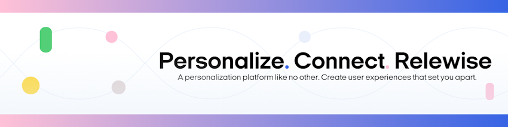

  

# Relewise commercetools connect integration

The Relewise commercetools connect integration provides a default way of synchronizing your product catalog from commercetools to Relewise in order to use our product discoverability features.

The commercetools connect integration serves as a robust bridge between the commercetools platform and Relewise, facilitating seamless synchronization of product data. This integration streamlines the process of managing products across both platforms, ensuring consistency and accuracy in product information while minimizing manual efforts.
The integration automates the synchronization process, ensuring that product data is regularly updated and consistent across both commercetools and Relewise platforms. This eliminates the need for manual data entry and reduces the risk of errors.

## Deployment configuration

Here you can see the details about various variables in configuration. You need access to a Relewise Dataset in order to be able to setup the integration.

### Default connect configration
- CTP_PROJECT_KEY: The key of commercetools project.
- CTP_CLIENT_ID: The client ID of your commercetools user account. It is used in commercetools client to communicate with commercetools platform via SDK.
- CTP_CLIENT_SECRET: The client secret of commercetools user account. It is used in commercetools client to communicate with commercetools platform via SDK.
- CTP_SCOPE: The scope constrains the endpoints to which the commercetools client has access, as well as the read/write access right to an endpoint.
- CTP_REGION: As the commercetools APIs are provided in six different region, it defines the region which your commercetools user account belongs to.
  
### Relewise integration specific configration
- RELEWISE_STORE_KEY: The Key for the store to which from the export is going to be performed on.
- RELEWISE_DATASET_ID: The DatasetId in Relewise.
- RELEWISE_API_KEY: ApiKey with access to perform Product Updates.
- RELEWISE_SERVER_URL: The Server URL your dataset is hosted on.

The DatasetId, ApiKey and ServerUrl can be found via https://my.relewise.com - which you need access to, in order to be able to view the products imported into Relewise.

## Support & contact

If you run into any issues with the integration, please feel free to reach out. There are multiple ways of reaching us. Check out [here](https://docs.relewise.com/docs/developer/support.html) for more information.

## Contributing

Pull requests are always welcome.  
Please fork this repository and make a PR when you are ready with your contribution.  

Otherwise you are welcome to open an Issue in our [issue tracker](https://github.com/Relewise/relewise-integrations-commercetools-connect/issues).

## License

relewise-integrations-commercetools-connect is licensed under the [MIT license](./LICENSE)
