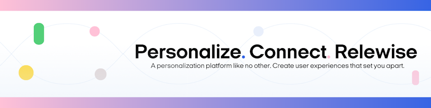

<p align="center">
  <a href="https://relewise.com/">
    
  </a>
</p>

# Relewise commercetools Connect integration

This connector synchronizes the products assigned to product selections for a commercetools Store into Relewise. It runs as a scheduled commercetools Connect job and performs an authoritative full synchronization: products seen in a successful run are enabled in Relewise, while products no longer present are disabled.

## How synchronization works

Each run:

1. Reads categories in deterministic pages.
2. Reads product-selection assignments for the configured Store.
3. Fetches Store-projected product data with bounded concurrency.
4. Maps and sends products to Relewise in batches using one shared `ImportedAt` timestamp.
5. After every product batch succeeds, enables products marked by the run and disables older products.

The final enable/disable actions are skipped when commercetools returns no products or when any source read or Relewise write fails. This prevents a partial or misconfigured import from disabling the existing Relewise catalog. Transient commercetools and Relewise failures are retried with bounded exponential backoff.

## Product mapping

- Product ID: commercetools product key, falling back to product ID.
- Variant ID: SKU, falling back to the numeric commercetools variant ID.
- Display name: localized product name.
- Category paths: commercetools category ancestors and assigned categories.
- Product data: `ImportedAt`, `Id`, `Decription`, `Slug`, `SearchKeywords`, and `InStock`.
- Variant data: `Id`, `IsMasterVariant`, `ImageUrls`, `InStock`, and `AvailableQuantity`.
- Prices: list and discounted sales prices grouped by country and currency.

`Decription` is an intentionally preserved legacy key. Correcting its spelling would be a breaking data migration for existing consumers.

## Requirements

- A commercetools Project with a Store and product selections.
- commercetools API Client credentials with permission to view products, product selections, and categories.
- A Relewise dataset and an API key allowed to perform product updates and administrative actions.
- Node.js 24 for local development.
- npm, using the committed lockfile.

## Configuration

The deployment contract is defined in [`connect.yaml`](./connect.yaml). The job runs hourly by default (`0 * * * *`); a deployment can override the schedule.

### Standard configuration

| Variable     | Description                                               |
| ------------ | --------------------------------------------------------- |
| `CTP_REGION` | commercetools API region, for example `europe-west1.gcp`. |

### Secured configuration

| Variable              | Description                                    |
| --------------------- | ---------------------------------------------- |
| `CTP_PROJECT_KEY`     | commercetools Project key.                     |
| `CTP_CLIENT_ID`       | commercetools API Client ID.                   |
| `CTP_CLIENT_SECRET`   | commercetools API Client secret.               |
| `CTP_SCOPE`           | OAuth scopes assigned to the API Client.       |
| `RELEWISE_STORE_KEY`  | Key of the commercetools Store to synchronize. |
| `RELEWISE_DATASET_ID` | Relewise dataset ID.                           |
| `RELEWISE_API_KEY`    | Relewise API key.                              |
| `RELEWISE_SERVER_URL` | Relewise API server URL for the dataset.       |

The Relewise values are available in [My Relewise](https://my.relewise.com). Keep all credentials out of source control and logs.

## Local development

From `full-sync`:

```powershell
npm ci
Copy-Item .env.example .env
# Fill in the development values in .env
npm run start:dev
```

Trigger the local job with an empty POST request:

```powershell
Invoke-WebRequest -Method Post -Uri http://localhost:8080/full-sync
```

The endpoint returns `204 No Content` only after the synchronization and final administrative actions complete. Errors return a sanitized response while detailed diagnostics are written through the application logger.

## Validation

Run the same checks as CI from `full-sync`:

```powershell
npm ci
npm run type-check
npm run lint
npm run format:check
npm run build
npm run test:ci
npm audit
```

Tests mock external services and do not require commercetools or Relewise credentials.

## Deployment and releases

commercetools Connect builds the `full-sync` application from the committed `package-lock.json`. The `gcp-build` and `start` package scripts compile and run the application. Deployment lifecycle scripts are intentionally omitted because this connector does not create or remove external commercetools resources during deployment.

Validate changes through a Connect preview or sandbox deployment before production. Publish immutable connector versions using Git tags so deployments can refer to a known source revision and lockfile.

Operationally, monitor job duration, product counts, transient retries, and failures. A failed job is safe to rerun because product updates carry a run timestamp and finalization happens only after all product batches succeed.

## Dependency maintenance

Dependabot checks GitHub Actions dependencies monthly. Repository maintainers use the `upgrade-dependencies` skill in `.agents/skills` for coordinated npm upgrades, validation, and the Trello-linked pull request workflow.

## Support and contributing

For support options, see the [Relewise support documentation](https://docs.relewise.com/docs/developer/support.html).

Pull requests are welcome. Include tests for behavior changes, run the validation suite, update documentation for user-visible changes, and put the relevant Trello card URL on the first line of the pull request description.

Report defects through the [issue tracker](https://github.com/Relewise/relewise-integrations-commercetools-connect/issues).

## License

This repository is licensed under the [MIT license](./LICENSE).
